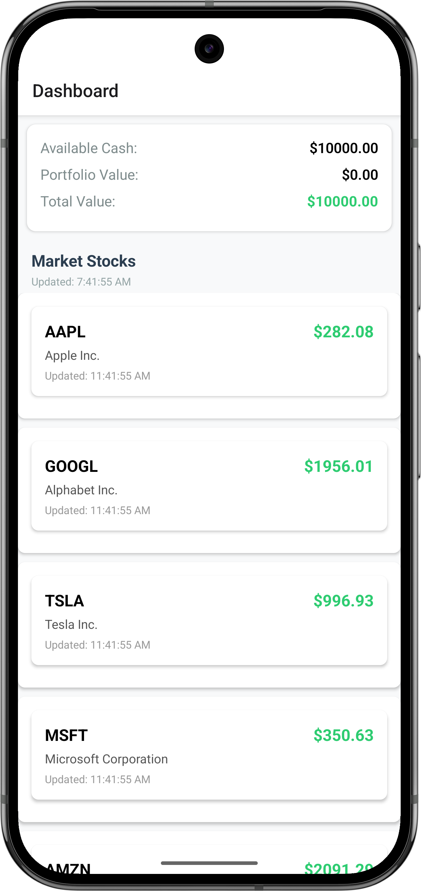

# 📈 PaperTradingApp

A React Native application for **paper trading** using real-time stock prices. Users can simulate buying and selling stocks, track trade history, and monitor portfolio performance — all without spending real money.

## 🚀 Features

- 📊 Real-time stock price dashboard
- 🛒 Simulated Buy/Sell trades
- 💼 Portfolio with trade history
- 🔁 Persistent storage using AsyncStorage
- 💹 Track profit/loss and balance updates (coming soon)


## 📱 Screenshots

Here are a few screenshots showcasing key features of the app:

| Home Screen |
|-------------|
|  |


## 🧠 Technologies Used

- React Native (v0.73+)
- TypeScript
- React Navigation
- Axios for API requests
- AsyncStorage for persistent storage

## 📦 Installation

### Prerequisites

- Node.js >= 16.x
- Android Studio with emulator or Android device
- React Native CLI

### 1. Clone the repo

```bash
git clone https://github.com/your-username/PaperTradingApp.git
cd PaperTradingApp
````

### 2. Install dependencies

```bash
npm install
```

### 3. Start Metro bundler

```bash
npm start
```

### 4. Run the app on Android

```bash
npx react-native run-android
```

## 📁 Project Structure

```
PaperTradingApp/
├── App.tsx                      # App entry point
├── api/                         # API logic
│   └── stockApi.ts              # Fetch stock prices
├── components/                  # UI components
│   ├── StockCard.tsx
│   └── PortfolioItem.tsx
├── screens/                     # App screens
│   ├── DashboardScreen.tsx
│   ├── TradeScreen.tsx
│   └── PortfolioScreen.tsx
├── navigation/                  # Navigation setup
│   └── AppNavigator.tsx
├── types/                       # TypeScript interfaces
│   └── index.ts
├── utils/                       # Utility functions
│   └── Storage.ts               # AsyncStorage helpers
├── package.json
└── tsconfig.json
```

## 📈 Stock Price API

This app fetches real-time data from:

```
https://spkdroid.com/stock/api.php
```

The API returns:

```json
{
  "stocks": [
    {
      "symbol": "AAPL",
      "name": "Apple Inc.",
      "price": 199.88,
      ...
    },
    ...
  ],
  "metadata": {
    "last_updated": "...",
    "next_update": "..."
  }
}
```

---

## 🔐 Storage

Trade data is saved locally using **AsyncStorage** in the form:

```ts
interface Trade {
  symbol: string;
  name: string;
  price: number;
  quantity: number;
  type: 'BUY' | 'SELL';
  date: string;
}
```

## 🧪 Coming Soon

* ✅ Profit/Loss summary screen
* ✅ Balance updates (starting from \$10,000)
* 📉 Charting and analysis
* 💬 Transaction confirmation modals

## 📚 License

MIT License — feel free to use and contribute.


## 👨‍💻 Author

**Ramkumar Velmurugan** – [spkdroid.com](https://spkdroid.com)
